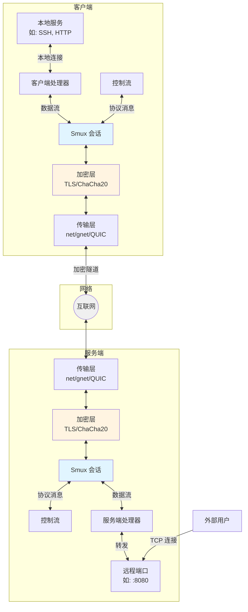
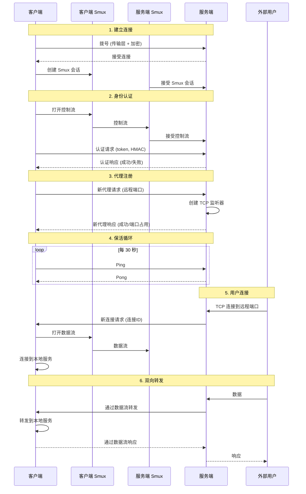
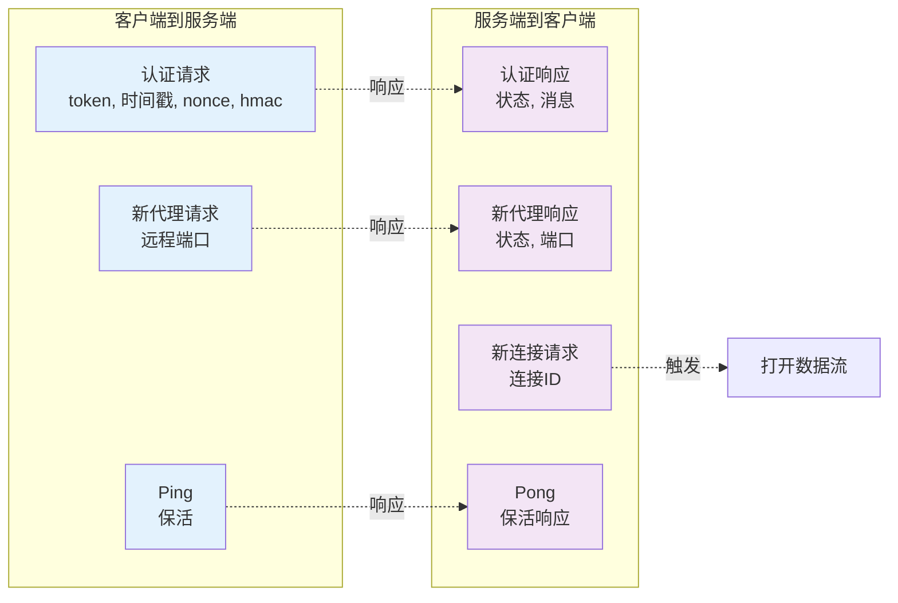

# QTRP - 快速 TCP 反向代理

## 项目概述

QTRP 是一个用 Go 编写的高性能反向代理和 TCP 隧道工具。它通过防火墙和 NAT 提供安全隧道，支持多种传输层和加密方法，并具有受 Hysteria 启发的性能优化。

## 核心特性

- **多种传输层**
  - 标准 Go net（兼容性最好）
  - gnet（事件驱动，性能最高）
  - QUIC（基于 UDP，内置加密，防火墙友好）

- **灵活的加密**
  - TLS 加密
  - ChaCha20-Poly1305
  - 无加密（用于可信网络）
  - QUIC 传输默认包含 TLS 1.3

- **高性能**
  - Brutal 拥塞控制算法（受 Hysteria 启发）
  - 通过 smux 实现连接复用
  - 缓冲池减少 GC 压力
  - 优化的 TCP 参数

- **高级功能**
  - 基于 Token 的 HMAC 认证
  - 端口范围支持（如 8000-8005）
  - 实时统计仪表板
  - 自动重连
  - 保活机制

## 架构设计

### 整体架构



### 连接流程



### 协议消息



## 快速开始

### 前置要求

- Go 1.24 或更高版本
- Git

### 安装

```bash
# 克隆仓库
git clone <repository-url>
cd qtrp

# 下载依赖
go mod tidy
```

### 构建

```bash
# 构建服务端
go build -o qtrp-server.exe ./cmd/server

# 构建客户端
go build -o qtrp-client.exe ./cmd/client

# 或同时构建两者
go build ./cmd/server && go build ./cmd/client
```

### 配置说明

#### 服务端配置 (server.yaml)

```yaml
bind: 0.0.0.0:6000           # 服务器绑定地址
transport: net                # 传输层: net, gnet, quic
crypto: tls                   # 加密方式: tls, chacha20, none
auth:
  tokens:
    - your-secret-token       # 认证令牌

# 可选：拥塞控制
brutal:
  enabled: true
  target_mbps: 100           # 目标带宽（Mbps）
```

#### 客户端配置 (client.yaml)

```yaml
server: 127.0.0.1:6000        # 服务器地址
transport: net                 # 传输层: net, gnet, quic
crypto: tls                    # 加密方式: tls, chacha20, none
token: your-secret-token       # 必须与服务器令牌匹配

proxies:
  - remote_port: 8080          # 服务器上的端口
    local_addr: 127.0.0.1:80   # 要转发到的本地服务

  - remote_port: 2222
    local_addr: 127.0.0.1:22

  # 端口范围示例（扩展为 8000-8005）
  - remote_port: 8000-8005
    local_addr: 127.0.0.1:8000

# 可选：拥塞控制
brutal:
  enabled: true
  target_mbps: 100
```

### 运行

```bash
# 启动服务端
./qtrp-server.exe -c server.yaml

# 启动客户端
./qtrp-client.exe -c client.yaml

# 或使用默认配置
go run ./cmd/server/main.go
go run ./cmd/client/main.go
```

### 使用示例

#### 场景：将本地 SSH 服务暴露到公网

**1. 在 VPS 上配置服务端（有公网 IP）**

```yaml
# server.yaml
bind: 0.0.0.0:6000
transport: net
crypto: tls
auth:
  tokens:
    - my-secret-token-123
```

**2. 在本地机器配置客户端**

```yaml
# client.yaml
server: your-vps-ip:6000
transport: net
crypto: tls
token: my-secret-token-123
proxies:
  - remote_port: 2222
    local_addr: 127.0.0.1:22
```

**3. 从任何地方连接**

```bash
ssh -p 2222 user@your-vps-ip
```

## 传输层选择指南

| 传输层 | 优点 | 缺点 | 最适合场景 |
|--------|------|------|-----------|
| **net** | 兼容性最好，稳定可靠 | 性能中等 | 一般使用，生产环境 |
| **gnet** | 性能最高，事件驱动 | Linux/macOS 最优，复杂度高 | 高并发场景，大量连接 |
| **quic** | 基于 UDP，内置加密，NAT 友好 | 需要 UDP 端口 | 丢包网络，严格防火墙环境 |

## 性能优化

### Brutal 拥塞控制

受 Hysteria 启发，实现固定速率带宽控制和动态丢包补偿：

- **固定目标速率**：维护配置的目标带宽（Mbps）
- **动态补偿**：使用滑动窗口监控 ACK 速率
- **丢包检测**：计算有效带宽 = `目标带宽 / ACK速率`
- **调速器集成**：使用令牌桶算法实现平滑限速

在配置中启用：

```yaml
brutal:
  enabled: true
  target_mbps: 100  # 设置目标带宽为 100 Mbps
```

### Smux 配置优化

针对高吞吐量优化的设置：
- 协议版本 2（更好的性能）
- 65535 字节最大帧大小
- 16MB 接收缓冲区（支持大窗口）
- 2MB 流缓冲区（对高吞吐量至关重要）

### 连接池优化

- 缓冲池减少 GC 压力
- TCP 连接优化工具
- 可重用的连接池管理

## 开发和测试

### 运行测试

```bash
# 运行所有测试
go test ./test/...

# 运行特定测试文件
go test ./test/auth_test.go
go test ./test/crypto_test.go
go test ./test/protocol_test.go

# 运行基准测试
go test -bench=. ./test/benchmark_test.go

# 详细输出
go test -v ./test/...
```

### 依赖管理

```bash
# 整理依赖
go mod tidy

# 下载依赖
go get ./...

# 列出依赖
go list -m all
```

## 统计仪表板

服务端通过 HTTP API 提供统计仪表板：

```bash
# 访问统计信息（默认端口可能不同）
curl http://localhost:8080/stats
```

返回的 JSON 包含：
- 活动客户端数
- 活动代理数
- 活动连接数
- 带宽统计

## 项目结构

```
qtrp/
├── cmd/
│   ├── server/          # 服务端入口
│   └── client/          # 客户端入口
├── internal/
│   ├── server/          # 服务端实现
│   │   ├── server.go    # 主逻辑和连接处理
│   │   ├── handler.go   # 请求处理器（双向转发）
│   │   └── dashboard.go # 统计仪表板 HTTP API
│   └── client/          # 客户端实现
│       ├── client.go    # 主逻辑和连接管理
│       └── handler.go   # 请求处理器（转发）
├── pkg/
│   ├── auth/            # 认证（Token + HMAC）
│   ├── config/          # 配置解析（YAML）
│   ├── congestion/      # Brutal 拥塞控制
│   │   ├── brutal.go    # Brutal 算法实现
│   │   └── pacer.go     # 令牌桶调速器
│   ├── crypto/          # 加密层
│   │   ├── tls_crypto.go      # TLS 加密
│   │   ├── chacha_crypto.go   # ChaCha20-Poly1305
│   │   └── cert.go            # 证书管理
│   ├── mux/             # Smux 会话管理
│   │   └── session.go   # 高性能配置
│   ├── pool/            # 连接/缓冲池
│   │   ├── buffer.go    # 缓冲池
│   │   ├── tcp.go       # TCP 优化
│   │   └── conn.go      # 连接池
│   ├── protocol/        # 协议消息（MessagePack）
│   │   ├── message.go   # 消息类型定义
│   │   └── codec.go     # 编解码器
│   ├── stats/           # 统计追踪
│   │   └── stats.go     # 全局统计
│   └── transport/       # 传输层抽象
│       ├── transport.go       # Transport 接口
│       ├── net_transport.go   # 标准 Go net
│       ├── gnet_transport.go  # gnet 实现
│       └── quic_transport.go  # QUIC 实现
└── test/                # 单元和集成测试
    ├── auth_test.go
    ├── crypto_test.go
    ├── protocol_test.go
    ├── mux_test.go
    ├── transport_test.go
    └── benchmark_test.go
```

## 核心组件说明

### 1. 传输层 (pkg/transport/)

提供多种传输实现的抽象：
- `Transport` 接口提供 `Listen()` 和 `Dial()` 方法
- 标准 Go net 实现
- 高性能 gnet 实现
- QUIC 传输（内置加密）

### 2. 多路复用层 (pkg/mux/)

使用 `smux` 库实现连接复用：
- 单个控制连接承载多个数据流
- 针对高带宽优化配置（16MB 接收缓冲，2MB 流缓冲）

### 3. 加密层 (pkg/crypto/)

`Crypto` 接口抽象加密方法：
- 支持 TLS、ChaCha20-Poly1305 和无加密
- QUIC 传输内置加密，跳过额外加密层
- 自动生成自签名证书

### 4. 协议层 (pkg/protocol/)

使用 MessagePack 实现高效序列化：
- 消息类型：Auth、NewProxy、NewConn、Ping/Pong
- 编解码器处理消息编码/解码

### 5. 拥塞控制 (pkg/congestion/)

**Brutal 算法**：固定目标速率 + 动态丢包补偿
**调速器**：基于令牌桶的速率限制
- 监控 ACK 速率并动态调整发送速率
- 类似 Hysteria 的带宽管理方式

### 6. 连接池 (pkg/pool/)

- 缓冲池减少 GC 压力
- TCP 连接优化工具
- 连接池管理

## 贡献

欢迎贡献代码！请随时提交 Pull Request。

## 许可证

[在此添加您的许可证]
